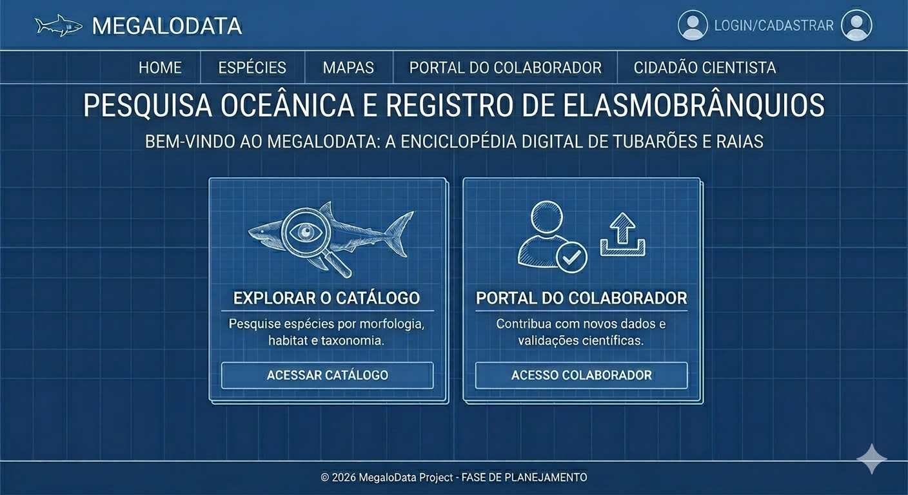
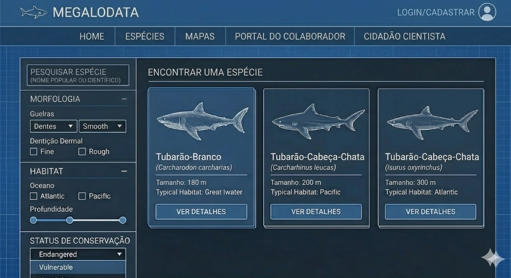
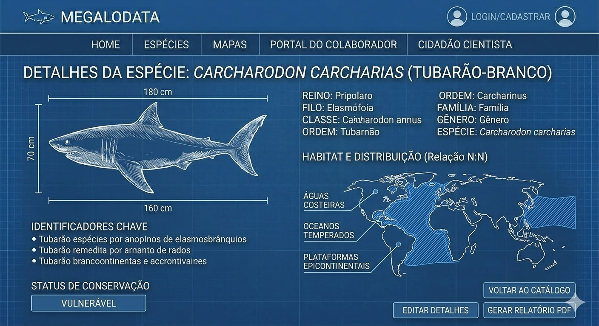
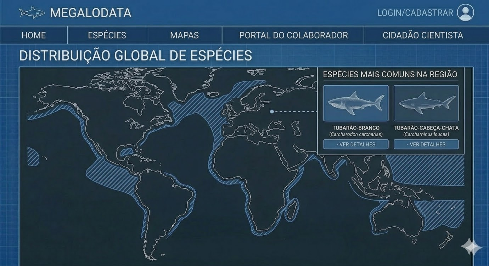
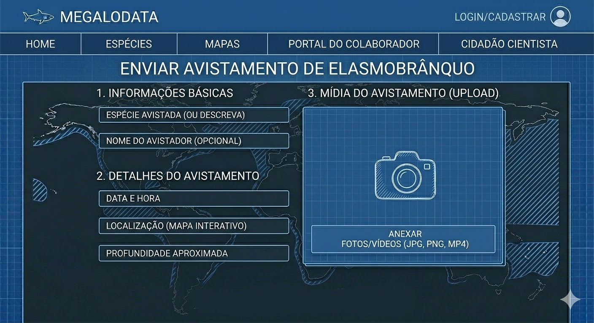
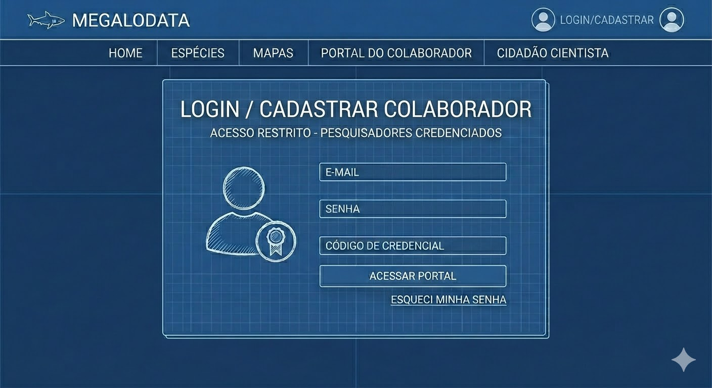
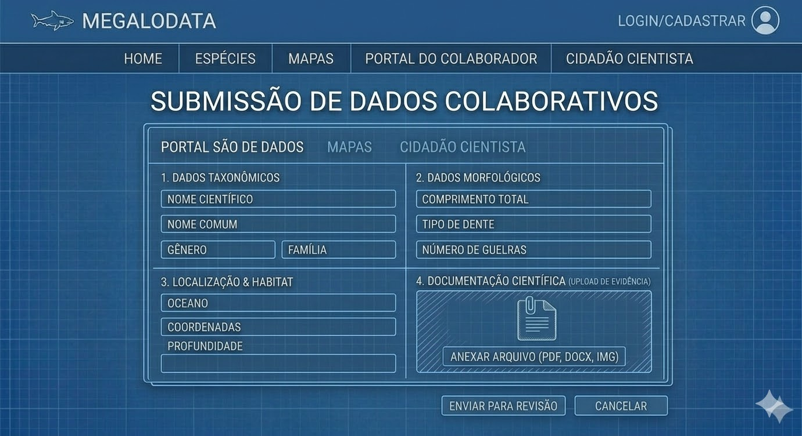
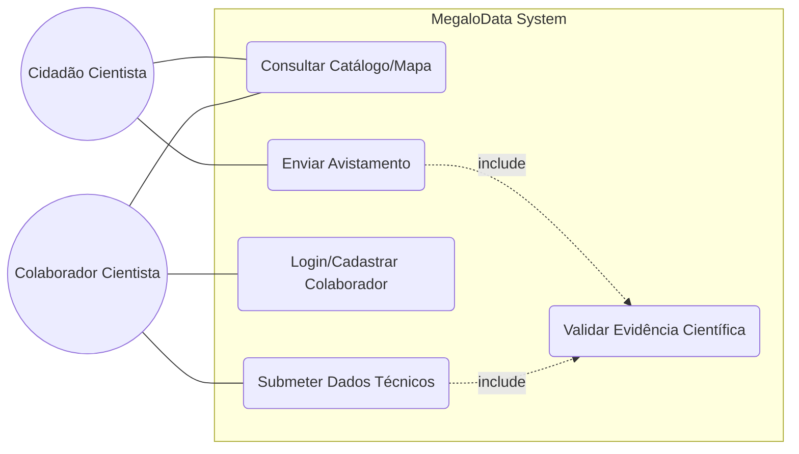
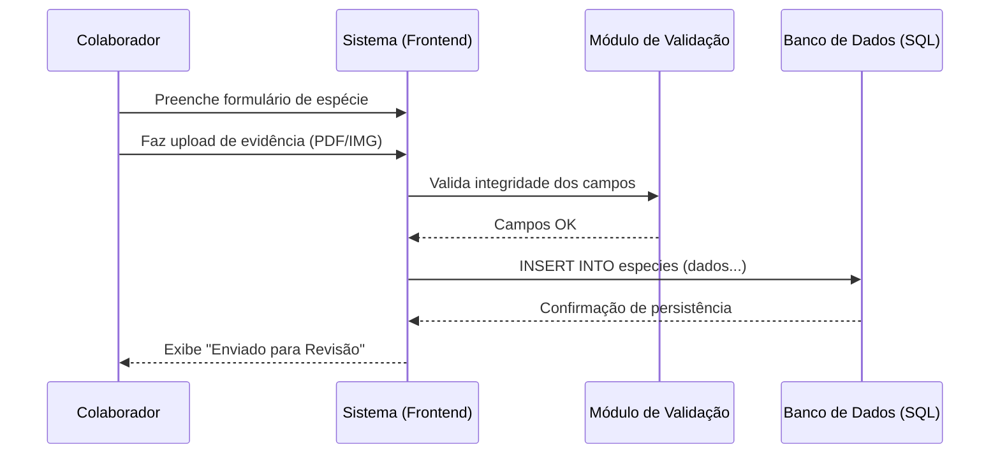
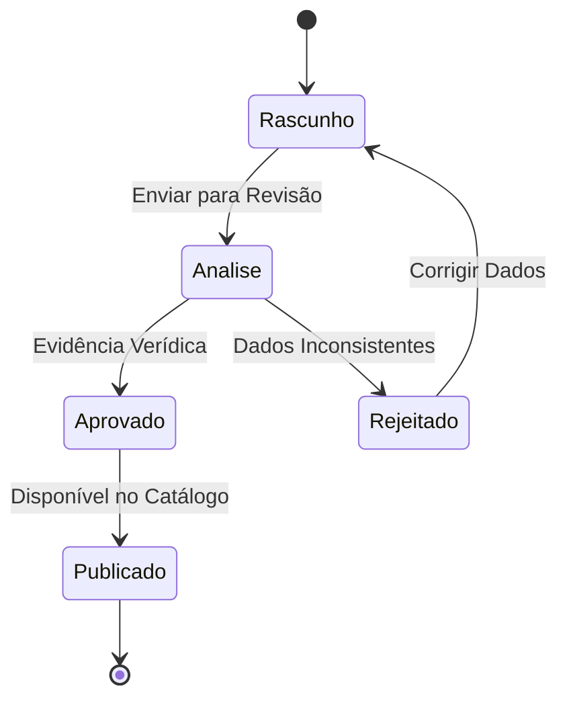

# 🦈 MegaloData: Enciclopédia de Identificação de Elasmobrânquios

O **MegaloData** é um projeto de sistema de catálogo e identificação biológica especializado em tubarões e raias. O objetivo principal é fornecer uma estrutura de dados robusta para que pesquisadores possam identificar espécies através de características morfológicas, genéticas e de habitat.

Este repositório documenta a **fase de planejamento e arquitetura** do software, simulando o estágio pré-desenvolvimento.

---

## 🌍 Por que o MegaloData é Vital?

A criação de uma enciclopédia digital estruturada para elasmobranquios vai além de um simples catálogo. Ela é fundamental por três pilares principais:

### 1. Conservação e Monitoramento de Espécies
Muitas espécies de tubarões estão em risco de extinção. Ter um sistema que permite cruzar dados de **Habitat** e **Taxonomia** ajuda ONGs e Governos a identificar áreas de proteção prioritárias. Sem dados estruturados, a ciência é lenta; com o MegaloData, a informação é acionável.

### 2. Integridade Científica vs. Caos de Dados
Dados biológicos costumam estar dispersos em planilhas não normalizadas. O MegaloData resolve isso aplicando **Normalização de Banco de Dados (3NF)**, garantindo que uma alteração em uma Família Biológica se propague corretamente para todas as Espécies vinculadas, evitando redundâncias e erros de catálogo.

### 3. Identificação em Tempo Real
Ao estruturar chaves de busca baseadas em **Morfologia** (dentes, nadadeiras, fendas branquiais), o sistema funciona como uma ferramenta de apoio para pesquisadores em campo, permitindo a identificação rápida através de parâmetros técnicos pré-definidos.

---

## 📋 Especificação de Requisitos

Abaixo estão listados os requisitos que norteiam a estrutura e o comportamento do sistema MegaloData.

### 1. Requisitos Funcionais (RF)
*O que o sistema deve fazer.*

| ID | Descrição | Ator |
|:---:|:---|:---:|
| **[RF01](https://github.com/Stelariz/MegaloData-Enciclop-dia-de-Identifica-o-de-Elasmobr-nquios/issues/2)** | O sistema deve permitir a consulta de espécies por filtros morfológicos (guelras, dentes, etc). | Todos |
| **[RF02](https://github.com/Stelariz/MegaloData-Enciclop-dia-de-Identifica-o-de-Elasmobr-nquios/issues/3)** | O sistema deve exibir um mapa interativo com a distribuição geográfica das espécies. | Todos |
| **[RF03](https://github.com/Stelariz/MegaloData-Enciclop-dia-de-Identifica-o-de-Elasmobr-nquios/issues/4)** | O sistema deve permitir que cidadãos enviem fotos e localizações de avistamentos. | Cidadão |
| **[RF04](https://github.com/Stelariz/MegaloData-Enciclop-dia-de-Identifica-o-de-Elasmobr-nquios/issues/5)** | O sistema deve exigir autenticação (e-mail/senha/credencial) para acesso ao Portal do Colaborador. | Colaborador |
| **[RF05](https://github.com/Stelariz/MegaloData-Enciclop-dia-de-Identifica-o-de-Elasmobr-nquios/issues/6)** | O sistema deve permitir que colaboradores cadastrem e editem dados técnicos de espécies. | Colaborador |
| **[RF06](https://github.com/Stelariz/MegaloData-Enciclop-dia-de-Identifica-o-de-Elasmobr-nquios/issues/7)** | O sistema deve obrigar o upload de evidência científica (PDF/IMG) em submissões técnicas. | Colaborador |
| **[RF07](https://github.com/Stelariz/MegaloData-Enciclop-dia-de-Identifica-o-de-Elasmobr-nquios/issues/8)** | O sistema deve permitir a exportação de fichas técnicas em formato PDF. | Todos |
| **[RF08](https://github.com/Stelariz/MegaloData-Enciclop-dia-de-Identifica-o-de-Elasmobr-nquios/issues/9)** | O sistema deve validar a unicidade do Nome Científico no banco de dados. | Sistema |

---

### 2. Requisitos Não Funcionais (RNF)
*Como o sistema deve operar (qualidade, performance, segurança).*

| ID | Categoria | Descrição |
|:---:|:---|:---|
| **[RNF01](https://github.com/Stelariz/MegaloData-Enciclop-dia-de-Identifica-o-de-Elasmobr-nquios/issues/10)** | **Integridade** | O banco de dados deve utilizar Foreign Keys (FK) para garantir a integridade referencial 3NF. |
| **[RNF02](https://github.com/Stelariz/MegaloData-Enciclop-dia-de-Identifica-o-de-Elasmobr-nquios/issues/11)** | **Performance** | Consultas complexas de cruzamento de dados (Taxonomia x Habitat) devem responder em < 200ms. |
| **[RNF03](https://github.com/Stelariz/MegaloData-Enciclop-dia-de-Identifica-o-de-Elasmobr-nquios/issues/12)** | **Segurança** | As senhas dos colaboradores devem ser armazenadas utilizando criptografia (hash). |
| **[RNF04](https://github.com/Stelariz/MegaloData-Enciclop-dia-de-Identifica-o-de-Elasmobr-nquios/issues/13)** | **Usabilidade** | A interface deve seguir o padrão de design técnico (Blueprint) e ser totalmente em português. |
| **[RNF05](https://github.com/Stelariz/MegaloData-Enciclop-dia-de-Identifica-o-de-Elasmobr-nquios/issues/14)** | **Disponibilidade**| O sistema deve ser acessível via navegador (Web) sem necessidade de instalação local. |
| **[RNF06](https://github.com/Stelariz/MegaloData-Enciclop-dia-de-Identifica-o-de-Elasmobr-nquios/issues/15)** | **Confiabilidade**| Toda submissão de dados deve passar por um módulo de validação de campos obrigatórios antes da persistência. |

---

### 3. Regras de Negócio (RN)
*Premissas que restringem as funcionalidades.*

- **RN01:** Um avistamento enviado por um cidadão só aparece no mapa global após revisão de um colaborador.
- **RN02:** Apenas usuários com "Código de Credencial" válido podem se cadastrar como Colaboradores.
- **RN03:** Não é permitido excluir uma "Família" do banco de dados se houver "Espécies" vinculadas a ela (Integridade Referencial).

---

## 🎨 Protótipos da Interface (Mockups)

Nesta fase de planejamento, a interface do **MegaloData** foi desenhada para atender a dois públicos: o pesquisador científico (colaborador) e o entusiasta marinho (cidadão cientista). Todas as telas seguem um padrão visual de *blueprint* técnico para reforçar a natureza acadêmica do projeto. As imagens deste projeto foram geradas por inteligência artificial, para ilustrar o escopo e a estrutura da interface, podendo conter inconsistências ou erros gráficos.

---

### 🏠 1. Homepage (Página Inicial)
A porta de entrada do sistema. Oferece uma visão clara das duas principais frentes do projeto: a exploração pública de dados e o portal restrito para pesquisadores. O cabeçalho padronizado permite navegação rápida entre as seções.

---

### 🔍 2. Catálogo e Filtros (Encontrar uma Espécie)
Esta tela permite a busca avançada no banco de dados. O usuário pode filtrar por **Morfologia** (guelras, dentes, dentição dermal), **Habitat** e **Status de Conservação**. Inclui uma barra de pesquisa para busca direta por nomes científicos ou populares.

---

### 📖 3. Detalhes da Espécie
Exibe a ficha técnica completa de um elasmobrânquio após a seleção no catálogo. Apresenta os dados normalizados do banco: taxonomia detalhada, medidas físicas e um mapa de distribuição global (relação N:N).

---

### 🗺️ 4. Distribuição Global (Mapa Interativo)
Uma visualização espacial das espécies. Ao interagir com o mapa, o usuário visualiza as espécies mais comuns em cada região oceânica, facilitando o entendimento de habitats e zonas de ocorrência.

---

### 🧪 5. Cidadão Cientista (Enviar Avistamento)
Tela dedicada ao público geral. Permite que qualquer pessoa contribua para o banco de dados enviando fotos, vídeos e localizações de avistamentos reais, promovendo a coleta de dados de forma colaborativa e aberta.

---

### 🔐 6. Login / Cadastrar Colaborador
Portal de autenticação restrito para especialistas. Garante que apenas usuários credenciados (com código de credencial verificado) possam editar ou inserir dados científicos sensíveis, mantendo a integridade do sistema.

---

### ✍️ 7. Submissão de Dados Colaborativos
Interface exclusiva do colaborador autenticado. É aqui que ocorre a alimentação técnica do banco de dados, exigindo o upload de evidências e documentação científica para cada novo registro de espécie ou alteração taxonômica.

---
## 📊 Modelagem do Sistema (Diagramas UML)

Nesta seção, detalhamos o comportamento e a estrutura lógica do **MegaloData** através de diagramas padrão UML.

> **Nota:** As interfaces e fluxos representados abaixo foram planejados para ilustrar o escopo do projeto. Imagens e conceitos visuais deste repositório foram gerados por inteligência artificial e podem conter inconsistências gráficas.

---

### 1. Diagrama de Casos de Uso (Use Case)
Este diagrama define as interações entre os diferentes atores (Cidadão, Colaborador e Sistema) e as funcionalidades principais.

### 2. Diagrama de Sequência: Submissão de Dados
Este diagrama ilustra a troca de mensagens e a ordem cronológica das interações entre o colaborador, o sistema e o banco de dados durante o cadastro de uma nova espécie.

### 3. Diagrama de Estados: Ciclo de Vida do Registro
Este diagrama descreve as diferentes etapas e condições pelas quais uma informação passa dentro do sistema, desde o rascunho inicial até a publicação oficial no catálogo.

---

## 🏗️ Estrutura do Sistema

O sistema foi desenhado seguindo uma arquitetura multicamadas, focando na integridade referencial dos dados taxonômicos.

### 📊 Modelagem de Dados (MER)
A base do projeto reside em um banco de dados relacional (SQL) para garantir que a hierarquia biológica seja respeitada:
* **Reinos/Ordens/Famílias:** Tabelas com relacionamentos `1:N`.
* **Espécies:** Entidade central com chaves estrangeiras para tabelas de morfologia.
* **Habitats:** Relacionamento `N:N` com espécies (uma espécie pode habitar vários oceanos).

### 🛠️ Tech Stack Planejada
* **Documentação:** Markdown / Mermaid.js (Diagramas).
* **Banco de Dados:** MySQL ou PostgreSQL.
* **Gestão de Projeto:** Kanban via GitHub Projects.
* **Qualidade (QA):** Cypress para testes de API e validação de schema.

---

## 🧪 Estratégia de Qualidade (QA)

Como o MegaloData lida com dados científicos, a precisão é crítica. O plano de testes foca em:
1.  **Data Integrity Testing:** Scripts SQL para garantir que não existam "espécies órfãs" sem família definida.
2.  **API Validation:** Garantir que os inputs de dados (JSON) sigam estritamente o modelo de dados definido.
3.  **Boundary Testing:** Validar se os limites de habitat (profundidade, temperatura) aceitam apenas valores realistas.

---

## 🚀 Planejamento (Kanban)

O desenvolvimento do MegaloData é gerenciado via GitHub Projects, focando na rastreabilidade dos requisitos funcionais e na qualidade de software.

---

## 🚀 Próximos Passos (Backlog)

Estes itens serão transformados em **Cards de Desenvolvimento** no GitHub Projects:
1.  Definição do DDL (Data Definition Language) para criação das tabelas iniciais.
2.  Mapeamento de Constraints (Check Constraints para tipos de dentes e nadadeiras).
3.  Criação de massa de dados (Seed) para as 5 principais ordens de tubarões.
4.  Desenho dos Mockups de interface para o módulo de busca avançada.

---

*Projeto acadêmico para a disciplina de Estrutura de Software da 2ª turma do curso de Big Data para Indústria - FATEC São Carlos.*
